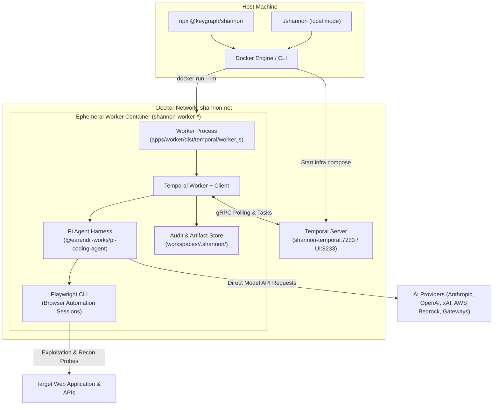
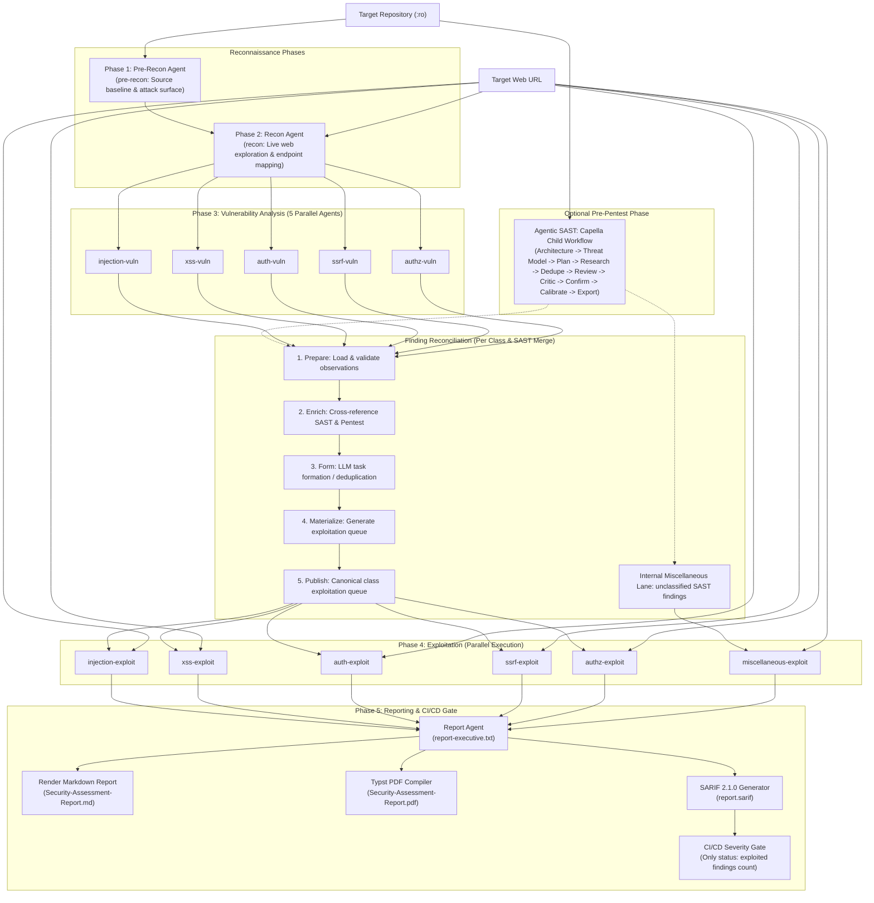

# 🗺️ PROJECT MAP: Shannon (Autonomous AI Pentester)

> **Last Ground-Truth Audit:** 2026-09-17T11:27:00+07:00  
> **Status:** 🟢 Synchronized with Git Workspace  

---

## 🧭 1. Task Compass (You Are Here)

- **Current Active Milestone:** Project Architecture & Codebase Mapping (Shannon 3.0)
- **Active Target Files:**
  - [PROJECT_MAP.md](file:///c:/Users/USER/Documents/GitHub/shannon/PROJECT_MAP.md) - [Action: Create]
- **Current Objective:** Conduct a comprehensive, zero-hallucination ground-truth analysis of the Shannon monorepo and establish an immutable spatial navigation map covering the dual CLI architecture, Temporal workflow pipeline, Pi harness integration, Capella agentic SAST engine, finding reconciliation subsystem, and audit logging layers.
- **Completed Milestones:**
  - ✅ **[2026-09-17] Deep Architectural Inspection:** Scanned workspace root, `apps/cli`, `apps/worker`, package configurations, build tools, prompts, and types against git reality (`main` branch, working tree clean).
  - ✅ **[2026-09-17] Project Map Creation:** Initialized `PROJECT_MAP.md` adhering strictly to the Project Map Navigator schema.
- **Next Immediate Steps:**
  1. Keep `PROJECT_MAP.md` synchronized whenever modifying CLI commands, Temporal activities/workflows, prompts, or reconciliation contracts.
  2. Verify all upcoming feature implementations or refactors against the Component Registry and State of Truth contracts.

---

## 🌐 2. System Topology & Architecture

### System Execution & Runtime Topology



### Five-Phase Pipeline & Reconciliation Flow



### Key Entry Points & Root Files

- **CLI Shell Wrapper:** [shannon](file:///c:/Users/USER/Documents/GitHub/shannon/shannon) - Executable Node script delegating to `apps/cli/dist/index.mjs` with `SHANNON_LOCAL=1`.
- **CLI Dispatcher:** [apps/cli/src/index.ts](file:///c:/Users/USER/Documents/GitHub/shannon/apps/cli/src/index.ts) - Command dispatcher for `setup`, `start`, `stop`, `reset`, `logs`, `status`, `scans`, `build`, and `version`.
- **Worker Process Entry:** [apps/worker/src/temporal/worker.ts](file:///c:/Users/USER/Documents/GitHub/shannon/apps/worker/src/temporal/worker.ts) - Ephemeral worker initialization, Temporal connection, pipeline argument resolution, and execution runner.
- **Main Workflow Orchestrator:** [apps/worker/src/temporal/workflows.ts](file:///c:/Users/USER/Documents/GitHub/shannon/apps/worker/src/temporal/workflows.ts) - Deterministic Temporal workflow orchestrating phases, child workflows, and failure handling.
- **Agentic SAST Workflow:** [apps/worker/src/ai/sast/capella/temporal/workflow.ts](file:///c:/Users/USER/Documents/GitHub/shannon/apps/worker/src/ai/sast/capella/temporal/workflow.ts) - Deterministic child workflow orchestrating the 10-stage Capella static analysis pipeline.
- **Docker Orchestrator:** [apps/cli/src/docker.ts](file:///c:/Users/USER/Documents/GitHub/shannon/apps/cli/src/docker.ts) - Manages Temporal infrastructure containers, worker container spawning (`docker run --rm`), volume mounts, UID remapping, and `/etc/hosts` forwarding.

---

## 📂 3. Component & File Registry

### Root Workspace & Infrastructure

| File Path | Responsibility & Domain | Key Exports | Primary Dependencies |
| :--- | :--- | :--- | :--- |
| [package.json](file:///c:/Users/USER/Documents/GitHub/shannon/package.json) | Monorepo configuration, build scripts, and shared tooling | `build`, `check`, `biome`, `clean`, `temporal:worker` | `turbo`, `@biomejs/biome`, `typescript` |
| [pnpm-workspace.yaml](file:///c:/Users/USER/Documents/GitHub/shannon/pnpm-workspace.yaml) | PNPM workspace configuration declaring package boundaries | `packages: ["apps/*"]` | PNPM |
| [turbo.json](file:///c:/Users/USER/Documents/GitHub/shannon/turbo.json) | Turborepo pipeline caching and task orchestration | Build/check/clean pipeline definitions | `turbo` |
| [tsconfig.base.json](file:///c:/Users/USER/Documents/GitHub/shannon/tsconfig.base.json) | Shared TypeScript compiler configuration for all packages | Compiler options: ES2022, Node16 module resolution, strict mode | TypeScript |
| [biome.json](file:///c:/Users/USER/Documents/GitHub/shannon/biome.json) | Biome code style, linter, formatter, and import sorter rules | Formatter and linter ruleset | `@biomejs/biome` |
| [docker-compose.yml](file:///c:/Users/USER/Documents/GitHub/shannon/docker-compose.yml) | Local mode Temporal infrastructure definition | `shannon-temporal` service on port 7233 / 8233 | Docker Compose, Temporal |
| [Dockerfile](file:///c:/Users/USER/Documents/GitHub/shannon/Dockerfile) | Multi-stage production container build (Wolfi runtime + Chromium + Typst + Node.js) | Worker runtime container | Chainguard Wolfi, Node.js, Chromium, Typst, Playwright |
| [entrypoint.sh](file:///c:/Users/USER/Documents/GitHub/shannon/entrypoint.sh) | Container entrypoint script managing host UID/GID remapping | Runtime permission stabilizer | Shell |
| [.env.example](file:///c:/Users/USER/Documents/GitHub/shannon/.env.example) | Template for AI provider API keys, model configuration, and settings | Documentation of environment variables | Dotenv |
| [shannon](file:///c:/Users/USER/Documents/GitHub/shannon/shannon) | CLI executable binary launcher for local checkout mode | `SHANNON_LOCAL=1` launcher | Node.js, `apps/cli/dist/index.mjs` |

### `apps/cli` Package (`@keygraph/shannon`)

| File Path | Responsibility & Domain | Key Exports | Primary Dependencies |
| :--- | :--- | :--- | :--- |
| [apps/cli/package.json](file:///c:/Users/USER/Documents/GitHub/shannon/apps/cli/package.json) | CLI package metadata and npm package configuration | `@keygraph/shannon` binary definition | `@temporalio/client`, `@clack/prompts`, `dotenv`, `smol-toml` |
| [apps/cli/tsdown.config.ts](file:///c:/Users/USER/Documents/GitHub/shannon/apps/cli/tsdown.config.ts) | Bundler configuration emitting a single-file ESM binary | Bundler config | `tsdown` |
| [apps/cli/src/index.ts](file:///c:/Users/USER/Documents/GitHub/shannon/apps/cli/src/index.ts) | Main CLI entrypoint, argument parsing, command dispatch, and sudo check | CLI dispatcher execution | [args.ts](file:///c:/Users/USER/Documents/GitHub/shannon/apps/cli/src/args.ts), [mode.ts](file:///c:/Users/USER/Documents/GitHub/shannon/apps/cli/src/mode.ts), [commands/](file:///c:/Users/USER/Documents/GitHub/shannon/apps/cli/src/commands) |
| [apps/cli/src/mode.ts](file:///c:/Users/USER/Documents/GitHub/shannon/apps/cli/src/mode.ts) | Auto-detects whether CLI runs in `local` or `npx` mode | `getMode`, `isLocal`, `isDevMode`, `commandPrefix` | Node.js `fs`, `process.env` |
| [apps/cli/src/docker.ts](file:///c:/Users/USER/Documents/GitHub/shannon/apps/cli/src/docker.ts) | Docker compose infra management, image pulling/building, worker spawning | `ensureInfra`, `spawnWorker`, `ensureImage`, `runningContainersChecked` | Node.js `child_process`, `fs`, `crypto` |
| [apps/cli/src/temporal-client.ts](file:///c:/Users/USER/Documents/GitHub/shannon/apps/cli/src/temporal-client.ts) | Direct `@temporalio/client` read-only connection and scan status reader | `createTemporalClient`, `describeScan`, `queryProgress`, `stopScanExecution` | `@temporalio/client` |
| [apps/cli/src/env.ts](file:///c:/Users/USER/Documents/GitHub/shannon/apps/cli/src/env.ts) | Credential loading, provider credential validation, docker `-e` flag assembly | `loadEnv`, `validateCredentials`, `buildEnvFlags`, `hasExportedCredentials` | `dotenv`, [config/resolver.ts](file:///c:/Users/USER/Documents/GitHub/shannon/apps/cli/src/config/resolver.ts), [model-spec.ts](file:///c:/Users/USER/Documents/GitHub/shannon/apps/cli/src/model-spec.ts) |
| [apps/cli/src/model-spec.ts](file:///c:/Users/USER/Documents/GitHub/shannon/apps/cli/src/model-spec.ts) | `SHANNON_AI_MODEL` parsing and curated provider definitions | `parseModelSpec`, `resolveModelSpec`, `CURATED_PROVIDERS` | None |
| [apps/cli/src/home.ts](file:///c:/Users/USER/Documents/GitHub/shannon/apps/cli/src/home.ts) | Manages root storage directory (`~/.shannon/` in npx vs `./` in local) | `getShannonHome`, `getWorkspacesDir`, `configFileExists` | Node.js `os`, `path` |
| [apps/cli/src/paths.ts](file:///c:/Users/USER/Documents/GitHub/shannon/apps/cli/src/paths.ts) | Container and host path resolution for repos, configs, and models.json | `resolveRepoPath`, `resolveConfigPath`, `resolveModelsConfigPath` | Node.js `path`, `fs` |
| [apps/cli/src/workspaces.ts](file:///c:/Users/USER/Documents/GitHub/shannon/apps/cli/src/workspaces.ts) | Workspace name generator, launch state verification, and default resolution | `generateDefaultWorkspaceName`, `resolveDefaultWorkspace`, `listWorkspaces` | Node.js `path`, `fs` |
| [apps/cli/src/commands/start.ts](file:///c:/Users/USER/Documents/GitHub/shannon/apps/cli/src/commands/start.ts) | Command handler for `shannon start` (spawns container, attaches live status) | `start` | [docker.ts](file:///c:/Users/USER/Documents/GitHub/shannon/apps/cli/src/docker.ts), [temporal-client.ts](file:///c:/Users/USER/Documents/GitHub/shannon/apps/cli/src/temporal-client.ts), [scan/render.ts](file:///c:/Users/USER/Documents/GitHub/shannon/apps/cli/src/scan/render.ts) |
| [apps/cli/src/commands/setup.ts](file:///c:/Users/USER/Documents/GitHub/shannon/apps/cli/src/commands/setup.ts) | Interactive Clack-based credential wizard for npx mode | `setup` | `@clack/prompts`, [config/writer.ts](file:///c:/Users/USER/Documents/GitHub/shannon/apps/cli/src/config/writer.ts) |
| [apps/cli/src/commands/stop.ts](file:///c:/Users/USER/Documents/GitHub/shannon/apps/cli/src/commands/stop.ts) | Clean cancellation and termination of running scans and workers | `stop` | [temporal-client.ts](file:///c:/Users/USER/Documents/GitHub/shannon/apps/cli/src/temporal-client.ts), [docker.ts](file:///c:/Users/USER/Documents/GitHub/shannon/apps/cli/src/docker.ts) |
| [apps/cli/src/commands/status.ts](file:///c:/Users/USER/Documents/GitHub/shannon/apps/cli/src/commands/status.ts) | Live phase and agent progress tree renderer via Temporal query | `status` | [temporal-client.ts](file:///c:/Users/USER/Documents/GitHub/shannon/apps/cli/src/temporal-client.ts), [scan/derive.ts](file:///c:/Users/USER/Documents/GitHub/shannon/apps/cli/src/scan/derive.ts) |
| [apps/cli/src/commands/scans.ts](file:///c:/Users/USER/Documents/GitHub/shannon/apps/cli/src/commands/scans.ts) | Enumerates all active and completed scans across workspaces | `scans` | [temporal-client.ts](file:///c:/Users/USER/Documents/GitHub/shannon/apps/cli/src/temporal-client.ts), [workspaces.ts](file:///c:/Users/USER/Documents/GitHub/shannon/apps/cli/src/workspaces.ts) |
| [apps/cli/src/commands/logs.ts](file:///c:/Users/USER/Documents/GitHub/shannon/apps/cli/src/commands/logs.ts) | Live log tailing for unified scan log or per-agent files | `logs` | Node.js `fs`, [paths.ts](file:///c:/Users/USER/Documents/GitHub/shannon/apps/cli/src/paths.ts) |
| [apps/cli/src/commands/reset.ts](file:///c:/Users/USER/Documents/GitHub/shannon/apps/cli/src/commands/reset.ts) | Wipes all Temporal volumes and stops containers after typed confirmation | `reset` | [docker.ts](file:///c:/Users/USER/Documents/GitHub/shannon/apps/cli/src/docker.ts) |
| [apps/cli/src/commands/build.ts](file:///c:/Users/USER/Documents/GitHub/shannon/apps/cli/src/commands/build.ts) | Builds the `shannon-worker` Docker image locally | `build` | [docker.ts](file:///c:/Users/USER/Documents/GitHub/shannon/apps/cli/src/docker.ts) |
| [apps/cli/src/scan/derive.ts](file:///c:/Users/USER/Documents/GitHub/shannon/apps/cli/src/scan/derive.ts) | Pure status tree derivation mapping `PipelineState` to UI view models | `deriveStatus` | [pipeline.ts](file:///c:/Users/USER/Documents/GitHub/shannon/apps/cli/src/scan/pipeline.ts) |
| [apps/cli/src/scan/render.ts](file:///c:/Users/USER/Documents/GitHub/shannon/apps/cli/src/scan/render.ts) | Renders terminal progress tree with ANSI colors, spinners, and duration | `renderStatusTree` | [colors.ts](file:///c:/Users/USER/Documents/GitHub/shannon/apps/cli/src/colors.ts), [derive.ts](file:///c:/Users/USER/Documents/GitHub/shannon/apps/cli/src/scan/derive.ts) |

### `apps/worker` Package (`@shannon/worker`)

| File Path | Responsibility & Domain | Key Exports | Primary Dependencies |
| :--- | :--- | :--- | :--- |
| [apps/worker/package.json](file:///c:/Users/USER/Documents/GitHub/shannon/apps/worker/package.json) | Worker package manifest, dependencies, and internal exports map | `@shannon/worker` package definitions | `@temporalio/*`, `@earendil-works/*`, `ajv`, `js-yaml`, `typebox`, `zx` |
| [apps/worker/src/paths.ts](file:///c:/Users/USER/Documents/GitHub/shannon/apps/worker/src/paths.ts) | Centralized path constants for prompts, configs, reports, workspaces | `PROMPTS_DIR`, `INTERNAL_DIR`, `FINAL_REPORT_PDF_FILENAME`, `deliverablesDir` | Node.js `path`, `fs` |
| [apps/worker/src/session-manager.ts](file:///c:/Users/USER/Documents/GitHub/shannon/apps/worker/src/session-manager.ts) | Single source of truth for agent metadata, phases, prompt mappings | `AGENTS`, `AGENT_PHASE_MAP`, `PLAYWRIGHT_SESSION_MAPPING` | `zx`, [types/agents.ts](file:///c:/Users/USER/Documents/GitHub/shannon/apps/worker/src/types/agents.ts) |
| [apps/worker/src/config-parser.ts](file:///c:/Users/USER/Documents/GitHub/shannon/apps/worker/src/config-parser.ts) | Parses and validates target YAML configurations against JSON Schema | `parseConfig`, `distributeConfig`, `validateConfig` | `ajv`, `ajv-formats`, `js-yaml` |
| [apps/worker/src/temporal/worker.ts](file:///c:/Users/USER/Documents/GitHub/shannon/apps/worker/src/temporal/worker.ts) | Standalone worker executable running within ephemeral container | Worker bootloader, Temporal connection | `@temporalio/worker`, `@temporalio/client`, [workflows.ts](file:///c:/Users/USER/Documents/GitHub/shannon/apps/worker/src/temporal/workflows.ts) |
| [apps/worker/src/temporal/workflows.ts](file:///c:/Users/USER/Documents/GitHub/shannon/apps/worker/src/temporal/workflows.ts) | Main deterministic Temporal workflow (`pentestPipelineWorkflow`) | `pentestPipelineWorkflow`, `capellaWorkflow` | `@temporalio/workflow`, [shared.ts](file:///c:/Users/USER/Documents/GitHub/shannon/apps/worker/src/temporal/shared.ts) |
| [apps/worker/src/temporal/activities.ts](file:///c:/Users/USER/Documents/GitHub/shannon/apps/worker/src/temporal/activities.ts) | Temporal activities implementing heartbeat loop and delegating to services | `runPreReconAgent`, `runReconAgent`, `runInjectionVulnAgent`, etc. | `@temporalio/activity`, [services/](file:///c:/Users/USER/Documents/GitHub/shannon/apps/worker/src/services) |
| [apps/worker/src/temporal/shared.ts](file:///c:/Users/USER/Documents/GitHub/shannon/apps/worker/src/temporal/shared.ts) | Shared contracts, queries, and types between workflows and activities | `getProgress`, `capellaStageProgress`, `PipelineState`, `PipelineSummary` | None |
| [apps/worker/src/temporal/reconcile-activities.ts](file:///c:/Users/USER/Documents/GitHub/shannon/apps/worker/src/temporal/reconcile-activities.ts) | Temporal activity implementations for the finding reconciliation stages | `createReconciliationActivityRegistry` | `@temporalio/activity`, [ai/reconciliation/](file:///c:/Users/USER/Documents/GitHub/shannon/apps/worker/src/ai/reconciliation) |
| [apps/worker/src/temporal/reconcile-activity-types.ts](file:///c:/Users/USER/Documents/GitHub/shannon/apps/worker/src/temporal/reconcile-activity-types.ts) | Activity signature and budget profiles for reconciliation stages | `RECONCILIATION_ACTIVITY_PROFILES`, `resolveReconciliationActivityBudget` | None |
| [apps/worker/src/temporal/summary-mapper.ts](file:///c:/Users/USER/Documents/GitHub/shannon/apps/worker/src/temporal/summary-mapper.ts) | Maps `PipelineSummary` into human-readable `WorkflowSummary` | `toWorkflowSummary` | [types/run-state.ts](file:///c:/Users/USER/Documents/GitHub/shannon/apps/worker/src/types/run-state.ts) |
| [apps/worker/src/temporal/workflow-errors.ts](file:///c:/Users/USER/Documents/GitHub/shannon/apps/worker/src/temporal/workflow-errors.ts) | Formats and classifies workflow-level errors for Temporal reporting | `formatWorkflowError`, `classifyErrorCode` | [types/errors.ts](file:///c:/Users/USER/Documents/GitHub/shannon/apps/worker/src/types/errors.ts) |

### AI Integration & Pi Harness (`apps/worker/src/ai`)

| File Path | Responsibility & Domain | Key Exports | Primary Dependencies |
| :--- | :--- | :--- | :--- |
| [apps/worker/src/ai/models.ts](file:///c:/Users/USER/Documents/GitHub/shannon/apps/worker/src/ai/models.ts) | Resolves AI models via Pi `ModelRuntime`, handles credentials in-memory | `resolveModelSelection`, `parseModelSpec`, `RuntimeCredentialStore` | `@earendil-works/pi-ai`, [paths.ts](file:///c:/Users/USER/Documents/GitHub/shannon/apps/worker/src/paths.ts) |
| [apps/worker/src/ai/queue-schemas.ts](file:///c:/Users/USER/Documents/GitHub/shannon/apps/worker/src/ai/queue-schemas.ts) | TypeBox schemas validating exploitation queues for each vuln class | `INJECTION_EXPLOITATION_QUEUE_SCHEMA`, `XSS_...`, `AUTH_...`, `SSRF_...`, `AUTHZ_...` | `typebox` |
| [apps/worker/src/ai/submit-tool.ts](file:///c:/Users/USER/Documents/GitHub/shannon/apps/worker/src/ai/submit-tool.ts) | Custom Pi tool `submit_exploitation_queue` for capturing structured queues | `createSubmitTool` | `@earendil-works/pi-coding-agent`, `typebox` |
| [apps/worker/src/ai/pi/pi-executor.ts](file:///c:/Users/USER/Documents/GitHub/shannon/apps/worker/src/ai/pi/pi-executor.ts) | Core agent runner: starts Pi sessions, mounts tools, captures traces | `runPiPrompt` | `@earendil-works/pi-coding-agent`, [audit/](file:///c:/Users/USER/Documents/GitHub/shannon/apps/worker/src/audit) |
| [apps/worker/src/ai/pi/task-formation-executor.ts](file:///c:/Users/USER/Documents/GitHub/shannon/apps/worker/src/ai/pi/task-formation-executor.ts) | Runs LLM task-formation prompt in isolated Pi sessions to group findings | `createTaskFormationExecutor`, `TaskFormationExecutorError` | `@earendil-works/pi-coding-agent` |
| [apps/worker/src/ai/pi/capella-agent-executor.ts](file:///c:/Users/USER/Documents/GitHub/shannon/apps/worker/src/ai/pi/capella-agent-executor.ts) | Executes individual agentic SAST (Capella) stage prompts | `createCapellaAgentExecutor` | `@earendil-works/pi-coding-agent` |
| [apps/worker/src/ai/pi/permission-system.ts](file:///c:/Users/USER/Documents/GitHub/shannon/apps/worker/src/ai/pi/permission-system.ts) | Enforces `rules.avoid` code path denies via `@gotgenes/pi-permission-system` | `syncPermissionSystemConfig`, `permissionSystemConfigExists` | `@gotgenes/pi-permission-system` |
| [apps/worker/src/ai/pi/source-jail.ts](file:///c:/Users/USER/Documents/GitHub/shannon/apps/worker/src/ai/pi/source-jail.ts) | Restricts tool file access to ensure agents stay within allowed repository paths | `createSourceJail` | Node.js `path` |
| [apps/worker/src/ai/pi/task-tool.ts](file:///c:/Users/USER/Documents/GitHub/shannon/apps/worker/src/ai/pi/task-tool.ts) | Provides bounded child `task` sessions with constrained tools (`read`, `grep`, `bash`) | `createTaskTool`, `CHILD_TOOLS` | `@earendil-works/pi-coding-agent` |
| [apps/worker/src/ai/pi/session-tools.ts](file:///c:/Users/USER/Documents/GitHub/shannon/apps/worker/src/ai/pi/session-tools.ts) | Custom tools: `todo_write` and `glob` | `createTodoWriteTool`, `createGlobTool` | `@earendil-works/pi-coding-agent` |
| [apps/worker/src/ai/pi/retry-settings.ts](file:///c:/Users/USER/Documents/GitHub/shannon/apps/worker/src/ai/pi/retry-settings.ts) | Configures Pi retry policies (disables agent restart, leaves transport retry on) | `PI_RETRY_SETTINGS` | `@earendil-works/pi-coding-agent` |

### Finding Reconciliation Subsystem (`apps/worker/src/ai/reconciliation`)

| File Path | Responsibility & Domain | Key Exports | Primary Dependencies |
| :--- | :--- | :--- | :--- |
| [apps/worker/src/ai/reconciliation/contracts.ts](file:///c:/Users/USER/Documents/GitHub/shannon/apps/worker/src/ai/reconciliation/contracts.ts) | Data models for observations, tasks, producer fields, and digests | `ReconciliationObservation`, `ReconciliationTask`, `ArtifactKind` | [queue-schemas.ts](file:///c:/Users/USER/Documents/GitHub/shannon/apps/worker/src/ai/queue-schemas.ts) |
| [apps/worker/src/ai/reconciliation/stage-contracts.ts](file:///c:/Users/USER/Documents/GitHub/shannon/apps/worker/src/ai/reconciliation/stage-contracts.ts) | Stage input/output contracts, metrics, and failure definitions | `PrepareResult`, `EnrichSuccess`, `FormSuccess`, `MaterializeResult` | [contracts.ts](file:///c:/Users/USER/Documents/GitHub/shannon/apps/worker/src/ai/reconciliation/contracts.ts) |
| [apps/worker/src/ai/reconciliation/prepare.ts](file:///c:/Users/USER/Documents/GitHub/shannon/apps/worker/src/ai/reconciliation/prepare.ts) | Loads observations from pentest analysis and SAST stages, verifies lineage | `prepareClassReconciliation` | [artifact-store.ts](file:///c:/Users/USER/Documents/GitHub/shannon/apps/worker/src/ai/reconciliation/artifact-store.ts) |
| [apps/worker/src/ai/reconciliation/enrich.ts](file:///c:/Users/USER/Documents/GitHub/shannon/apps/worker/src/ai/reconciliation/enrich.ts) | Merges SAST findings with live pentest findings for identical targets | `createEnrichClassSastObservations` | [manifest.ts](file:///c:/Users/USER/Documents/GitHub/shannon/apps/worker/src/ai/reconciliation/manifest.ts) |
| [apps/worker/src/ai/reconciliation/form.ts](file:///c:/Users/USER/Documents/GitHub/shannon/apps/worker/src/ai/reconciliation/form.ts) | Groups and collapses observations into tasks using model task-formation | `createFormClassExploitTasks` | [task-formation-executor.ts](file:///c:/Users/USER/Documents/GitHub/shannon/apps/worker/src/ai/pi/task-formation-executor.ts) |
| [apps/worker/src/ai/reconciliation/materialize.ts](file:///c:/Users/USER/Documents/GitHub/shannon/apps/worker/src/ai/reconciliation/materialize.ts) | Materializes fixed tasks with canonical sequential IDs (`INJ-001`, etc.) | `materializeClassExploitTasks` | [materialize-core.ts](file:///c:/Users/USER/Documents/GitHub/shannon/apps/worker/src/ai/reconciliation/materialize-core.ts) |
| [apps/worker/src/ai/reconciliation/publish.ts](file:///c:/Users/USER/Documents/GitHub/shannon/apps/worker/src/ai/reconciliation/publish.ts) | Writes the finalized exploitation queue JSON for the exploit agent | `publishClassReconciliationOss` | [artifact-store.ts](file:///c:/Users/USER/Documents/GitHub/shannon/apps/worker/src/ai/reconciliation/artifact-store.ts) |
| [apps/worker/src/ai/reconciliation/artifact-store.ts](file:///c:/Users/USER/Documents/GitHub/shannon/apps/worker/src/ai/reconciliation/artifact-store.ts) | Content-addressed artifact store tracking SHA256 digests across stages | `ArtifactStore`, `ReconciliationError` | Node.js `crypto`, `fs` |
| [apps/worker/src/ai/reconciliation/seed-miscellaneous.ts](file:///c:/Users/USER/Documents/GitHub/shannon/apps/worker/src/ai/reconciliation/seed-miscellaneous.ts) | Seeds unclassified SAST findings into the internal `miscellaneous` lane | `seedEmptyProducerQueue` | [contracts.ts](file:///c:/Users/USER/Documents/GitHub/shannon/apps/worker/src/ai/reconciliation/contracts.ts) |

### Agentic SAST (Capella) Subsystem (`apps/worker/src/ai/sast`)

| File Path | Responsibility & Domain | Key Exports | Primary Dependencies |
| :--- | :--- | :--- | :--- |
| [apps/worker/src/ai/sast/types.ts](file:///c:/Users/USER/Documents/GitHub/shannon/apps/worker/src/ai/sast/types.ts) | Neutral contracts for Capella execution, stage definitions, and usage stats | `CAPELLA_STAGES`, `CAPELLA_STAGE_LABELS`, `CAPELLA_PROGRESS_STAGES`, `CapellaRunResult` | None |
| [apps/worker/src/ai/sast/sarif-profile.ts](file:///c:/Users/USER/Documents/GitHub/shannon/apps/worker/src/ai/sast/sarif-profile.ts) | SARIF profiles and rules mapping for static analysis findings | `toSarifProfile`, `validateSarifProfile` | None |
| [apps/worker/src/ai/sast/capella/temporal/workflow.ts](file:///c:/Users/USER/Documents/GitHub/shannon/apps/worker/src/ai/sast/capella/temporal/workflow.ts) | Child workflow running the 10-stage Capella pipeline with signals to parent | `capellaWorkflow`, `CAPELLA_CHILD_WORKFLOW_OPTIONS` | `@temporalio/workflow`, [activity-types.ts](file:///c:/Users/USER/Documents/GitHub/shannon/apps/worker/src/ai/sast/capella/temporal/activity-types.ts) |
| [apps/worker/src/ai/sast/capella/temporal/activities.ts](file:///c:/Users/USER/Documents/GitHub/shannon/apps/worker/src/ai/sast/capella/temporal/activities.ts) | Activity implementations for architecture, threat model, planning, research | `capellaArchitecture`, `capellaThreatModel`, `capellaPlan`, etc. | `@temporalio/activity`, [stages/](file:///c:/Users/USER/Documents/GitHub/shannon/apps/worker/src/ai/sast/capella/stages) |
| [apps/worker/src/ai/sast/capella/artifacts.ts](file:///c:/Users/USER/Documents/GitHub/shannon/apps/worker/src/ai/sast/capella/artifacts.ts) | Persists intermediate artifacts (threat models, knowledge bases, findings) | `saveCapellaArtifact`, `loadCapellaArtifact` | Node.js `fs`, `path` |
| [apps/worker/src/ai/sast/capella/sarif-exporter.ts](file:///c:/Users/USER/Documents/GitHub/shannon/apps/worker/src/ai/sast/capella/sarif-exporter.ts) | Exports calibrated SAST findings into standard SARIF 2.1.0 format | `exportCapellaSarif` | Node.js `fs` |
| [apps/worker/src/ai/sast/capella/validation.ts](file:///c:/Users/USER/Documents/GitHub/shannon/apps/worker/src/ai/sast/capella/validation.ts) | Validation routines for each stage's structured outputs | `validateArchitectureOutput`, `validateFindingOutput` | `ajv` |

### Business Services Layer (`apps/worker/src/services`)

| File Path | Responsibility & Domain | Key Exports | Primary Dependencies |
| :--- | :--- | :--- | :--- |
| [apps/worker/src/services/agent-execution.ts](file:///c:/Users/USER/Documents/GitHub/shannon/apps/worker/src/services/agent-execution.ts) | Orchestrates agent lifecycle: preflight, prompts, execution, commit | `AgentExecutionService` | [git-manager.ts](file:///c:/Users/USER/Documents/GitHub/shannon/apps/worker/src/services/git-manager.ts), [pi-executor.ts](file:///c:/Users/USER/Documents/GitHub/shannon/apps/worker/src/ai/pi/pi-executor.ts) |
| [apps/worker/src/services/error-handling.ts](file:///c:/Users/USER/Documents/GitHub/shannon/apps/worker/src/services/error-handling.ts) | Standardized error definitions, classification, and Temporal error mapping | `PentestError`, `classifyErrorForTemporal`, `isRetryableFailure` | [types/errors.ts](file:///c:/Users/USER/Documents/GitHub/shannon/apps/worker/src/types/errors.ts) |
| [apps/worker/src/services/container.ts](file:///c:/Users/USER/Documents/GitHub/shannon/apps/worker/src/services/container.ts) | Per-workflow service container (lifecycle holder for AgentExecution & ConfigLoader) | `getContainer`, `getOrCreateContainer`, `removeContainer` | None |
| [apps/worker/src/services/git-manager.ts](file:///c:/Users/USER/Documents/GitHub/shannon/apps/worker/src/services/git-manager.ts) | Git checkpoints, commit history, and deliverable file recovery | `executeGitCommandWithRetry`, `createCheckpoint`, `restoreCheckpoint` | `zx` |
| [apps/worker/src/services/preflight.ts](file:///c:/Users/USER/Documents/GitHub/shannon/apps/worker/src/services/preflight.ts) | Preflight validation: network connectivity, model credentials, repo state | `runPreflightChecks` | Node.js `net`, `http`, [ai/models.ts](file:///c:/Users/USER/Documents/GitHub/shannon/apps/worker/src/ai/models.ts) |
| [apps/worker/src/services/prompt-manager.ts](file:///c:/Users/USER/Documents/GitHub/shannon/apps/worker/src/services/prompt-manager.ts) | Renders prompt templates with variable replacement and partial includes | `renderPrompt`, `formatVulnClassScope` | `handlebars`, Node.js `fs` |
| [apps/worker/src/services/findings-renderer.ts](file:///c:/Users/USER/Documents/GitHub/shannon/apps/worker/src/services/findings-renderer.ts) | Converts exploitation queues to Markdown deliverable when `exploit: false` | `renderFindingsFromQueues` | [finding-order.ts](file:///c:/Users/USER/Documents/GitHub/shannon/apps/worker/src/services/finding-order.ts) |
| [apps/worker/src/services/reporting.ts](file:///c:/Users/USER/Documents/GitHub/shannon/apps/worker/src/services/reporting.ts) | Assembles class deliverable sections into final executive report | `assembleFinalReport`, `copyReportToRunRoot` | [git-manager.ts](file:///c:/Users/USER/Documents/GitHub/shannon/apps/worker/src/services/git-manager.ts) |
| [apps/worker/src/services/pdf-renderer.ts](file:///c:/Users/USER/Documents/GitHub/shannon/apps/worker/src/services/pdf-renderer.ts) | Compiles Typst report template into professional assessment PDF | `compilePdfReport`, `pdfProvenanceIsCurrent` | `zx` (Typst CLI) |
| [apps/worker/src/services/sarif-renderer.ts](file:///c:/Users/USER/Documents/GitHub/shannon/apps/worker/src/services/sarif-renderer.ts) | Emits SARIF 2.1.0 log for confirmed exploited findings | `renderSarifReport` | [types/run-state.ts](file:///c:/Users/USER/Documents/GitHub/shannon/apps/worker/src/types/run-state.ts) |
| [apps/worker/src/services/report-finalization.ts](file:///c:/Users/USER/Documents/GitHub/shannon/apps/worker/src/services/report-finalization.ts) | Deterministic assembly and finalization of report outputs and manifests | `finalizeReportOutputs` | [paths.ts](file:///c:/Users/USER/Documents/GitHub/shannon/apps/worker/src/paths.ts) |
| [apps/worker/src/services/report-output-surface.ts](file:///c:/Users/USER/Documents/GitHub/shannon/apps/worker/src/services/report-output-surface.ts) | Copies final PDF and Markdown reports to run root and mounted output dir | `surfaceReportOutputs` | Node.js `fs` |
| [apps/worker/src/services/compaction-core.ts](file:///c:/Users/USER/Documents/GitHub/shannon/apps/worker/src/services/compaction-core.ts) | Compacts and normalizes finding evidence before final reporting | `compactReportFindings` | None |
| [apps/worker/src/services/renumber-core.ts](file:///c:/Users/USER/Documents/GitHub/shannon/apps/worker/src/services/renumber-core.ts) | Assigns clean sequential IDs (`VULN-001`, `EXP-001`) across classes | `renumberClassFindings` | None |
| [apps/worker/src/services/validate-authentication.ts](file:///c:/Users/USER/Documents/GitHub/shannon/apps/worker/src/services/validate-authentication.ts) | Executes test login flow, validates session cookies, saves `auth-state.json` | `validateAuthentication` | Playwright CLI |

### Audit & Telemetry Subsystem (`apps/worker/src/audit`)

| File Path | Responsibility & Domain | Key Exports | Primary Dependencies |
| :--- | :--- | :--- | :--- |
| [apps/worker/src/audit/audit-session.ts](file:///c:/Users/USER/Documents/GitHub/shannon/apps/worker/src/audit/audit-session.ts) | Manages workspace audit directories, deliverables, and session metadata | `AuditSession` | Node.js `fs`, [utils.ts](file:///c:/Users/USER/Documents/GitHub/shannon/apps/worker/src/audit/utils.ts) |
| [apps/worker/src/audit/workflow-logger.ts](file:///c:/Users/USER/Documents/GitHub/shannon/apps/worker/src/audit/workflow-logger.ts) | Append-only human-readable workflow logging (`workflow.log`) | `WorkflowLogger` | [log-stream.ts](file:///c:/Users/USER/Documents/GitHub/shannon/apps/worker/src/audit/log-stream.ts) |
| [apps/worker/src/audit/actor-projection.ts](file:///c:/Users/USER/Documents/GitHub/shannon/apps/worker/src/audit/actor-projection.ts) | Projects unified log stream into per-agent log files (`.shannon/agents/<slug>.log`) | `projectActor` | None |
| [apps/worker/src/audit/metrics-tracker.ts](file:///c:/Users/USER/Documents/GitHub/shannon/apps/worker/src/audit/metrics-tracker.ts) | Tracks duration, token usage, cost, and retries per phase and agent | `MetricsTracker` | [types/metrics.ts](file:///c:/Users/USER/Documents/GitHub/shannon/apps/worker/src/types/metrics.ts) |
| [apps/worker/src/audit/log-stream.ts](file:///c:/Users/USER/Documents/GitHub/shannon/apps/worker/src/audit/log-stream.ts) | Thread-safe, reference-counted file write stream primitive | `LogStream`, `LogStreamLease` | Node.js `fs` |
| [apps/worker/src/audit/utils.ts](file:///c:/Users/USER/Documents/GitHub/shannon/apps/worker/src/audit/utils.ts) | Path resolvers for audit directories, session files, and auth state | `generateAuditPath`, `generateInternalPath`, `authStateFile` | Node.js `path` |

### Core Types & System Contracts (`apps/worker/src/types`)

| File Path | Responsibility & Domain | Key Exports | Primary Dependencies |
| :--- | :--- | :--- | :--- |
| [apps/worker/src/types/agents.ts](file:///c:/Users/USER/Documents/GitHub/shannon/apps/worker/src/types/agents.ts) | Closed union of all agent names, statuses, and definition interfaces | `ALL_AGENTS`, `AgentName`, `AgentDefinition`, `AgentStatus` | None |
| [apps/worker/src/types/config.ts](file:///c:/Users/USER/Documents/GitHub/shannon/apps/worker/src/types/config.ts) | Type definitions for target YAML configuration schema | `ALL_VULN_CLASSES`, `VulnClass`, `PentestConfig`, `AuthenticationConfig` | None |
| [apps/worker/src/types/run-state.ts](file:///c:/Users/USER/Documents/GitHub/shannon/apps/worker/src/types/run-state.ts) | Durable scan state schema, partial reason codes, and report progress types | `DurableScanState`, `PartialReason`, `ReportProgress`, `SAFE_RUN_STATE_MESSAGES` | None |
| [apps/worker/src/types/errors.ts](file:///c:/Users/USER/Documents/GitHub/shannon/apps/worker/src/types/errors.ts) | System error codes and provider failure category discriminators | `ErrorCode`, `isProviderFailureCategory` | None |
| [apps/worker/src/types/metrics.ts](file:///c:/Users/USER/Documents/GitHub/shannon/apps/worker/src/types/metrics.ts) | Metrics models for token counts, USD costs, and duration | `PhaseMetrics`, `AgentExecutionMetrics` | None |
| [apps/worker/src/types/reconciliation.ts](file:///c:/Users/USER/Documents/GitHub/shannon/apps/worker/src/types/reconciliation.ts) | Reconciliation class definitions (`injection`, `xss`, `auth`, `ssrf`, `authz`, `miscellaneous`) | `ReconciliationClass`, `ALL_RECONCILIATION_CLASSES` | None |

---

## ⚡ 4. State of Truth & Runtime Contracts

### Environment Variables & Credentials

| Variable Name | Required | Purpose | Scope / Secret Source |
| :--- | :---: | :--- | :--- |
| `SHANNON_AI_MODEL` | No | Model spec in `<provider>:<model-id>` format (default: `anthropic:claude-sonnet-4-6`) | CLI / Worker Container |
| `SHANNON_AI_API_KEY` | Conditional | Generic API key for any uncurated Pi harness provider or gateway | Secret (.env / config.toml) |
| `ANTHROPIC_API_KEY` | Conditional | API key for Anthropic models | Secret (.env / config.toml) |
| `CLAUDE_CODE_OAUTH_TOKEN` | Conditional | OAuth token fallback for Anthropic models | Secret (.env) |
| `OPENAI_API_KEY` | Conditional | API key for OpenAI models | Secret (.env / config.toml) |
| `XAI_API_KEY` | Conditional | API key for xAI (Grok) models | Secret (.env / config.toml) |
| `AWS_BEARER_TOKEN_BEDROCK` | Conditional | Bearer token for Amazon Bedrock models | Secret (.env / config.toml) |
| `AWS_REGION` | Conditional | AWS region for Amazon Bedrock (required if Bedrock is used) | `.env` / config.toml |
| `SHANNON_AI_BASE_URL` | No | Custom proxy / LLM gateway endpoint (e.g., LiteLLM, OpenRouter) | `.env` / config.toml |
| `SHANNON_USE_PI_AUTH` | No | Set to `1` to mount and reuse host's `~/.pi/agent/auth.json` (ChatGPT Plus/Pro, Grok subs) | Environment |
| `SHANNON_LOCAL` | No | Set to `1` by `./shannon` entry point to activate local development mode | Entry script |
| `SHANNON_FORWARD_HOSTS` | No | Forward user-added `/etc/hosts` entries to worker (default: `true`) | Environment |
| `SHANNON_TEMPORAL_RETENTION`| No | Temporal workflow execution retention period (default: `168h` / 7 days) | Environment |
| `TEMPORAL_ADDRESS` | Internal | Address of Temporal frontend gRPC server (`shannon-temporal:7233`) | Docker network |
| `SHANNON_DEBUG_PROVIDER_ERRORS`| No | Persist sanitized snippet of failed provider turn to `error.log` | Environment |

### Target Configuration Schema Contracts (`config.yaml`)

Configuration files are validated against the strict JSON Schema at [apps/worker/configs/config-schema.json](file:///c:/Users/USER/Documents/GitHub/shannon/apps/worker/configs/config-schema.json):

```yaml
# Target Application Assessment Config
description: "Staging deployment for e-commerce API"

# Optional authentication configuration
authentication:
  login_type: "form" # "form" | "sso" | "api" | "basic"
  login_url: "https://staging.example.com/login"
  credentials:
    username: "pentest-user"
    password: "secure-password"
    totp_secret: "JBSWY3DPEHPK3PXP" # Base32 secret for TOTP auto-generation
  login_flow:
    - "Navigate to login_url"
    - "Fill username in input[name='email']"
    - "Fill password in input[name='password']"
    - "Click button[type='submit']"
  success_condition:
    type: "url_contains" # "url_contains" | "element_present" | "url_equals_exactly" | "text_contains"
    value: "/dashboard"

# Scope control rules
rules:
  focus:
    - type: "url_path"
      value: "/api/v1/*"
  avoid:
    - type: "code_path" # Enforced by @gotgenes/pi-permission-system in Pi sessions
      value: "**/admin/**"

# Agentic static code analysis (Capella)
agentic_sast:
  enabled: "false" # "true" | "false" (defaults to "false")

# Exploitation toggle
exploit: "true" # "true" | "false" (set "false" for analysis-only mode)

# Report filtering and output guidance
report:
  min_severity: "medium" # "low" | "medium" | "high" | "critical"
  min_confidence: "medium" # "low" | "medium" | "high"
  sarif: "true" # "true" | "false" (defaults to "true" for exploit runs)
  guidance: "Drop informational findings"

rules_of_engagement: "Do not delete active test user accounts or alter billing state"
```

### Agent Deliverables & Internals Layout

Each scan executes within an isolated workspace directory: `workspaces/{workspace_name}/`:

```
workspaces/{workspace_name}/
├── Security-Assessment-Report.pdf        # Surfaced customer-facing PDF report
├── Security-Assessment-Report.md         # Surfaced customer-facing Markdown report
└── .shannon/                             # Hidden internal state directory
    ├── session.json                      # Durable scan state, completed agents, metrics
    ├── workflow.log                      # Canonical human-readable execution log
    ├── launch.json                       # Workspace launch metadata and lock proof
    ├── report.json                       # Structured findings output from report agent
    ├── report.sarif                      # SARIF 2.1.0 output log
    ├── report_finalization_manifest.json # Finalization verification manifest
    ├── agents/                           # Projected per-agent log files
    │   ├── pre-recon.log
    │   ├── recon.log
    │   ├── injection-vuln.log
    │   ├── injection-exploit.log
    │   └── report.log
    ├── deliverables/                     # Git-tracked deliverables from each agent
    │   ├── pre_recon_deliverable.md
    │   ├── recon_deliverable.md
    │   ├── injection_analysis_deliverable.md
    │   ├── injection_exploitation_queue.json
    │   ├── injection_exploitation_evidence.md
    │   └── comprehensive_security_assessment_report.md
    ├── reconciliation/                   # Intermediate reconciliation artifacts & digests
    └── .playwright/                      # Browser cookies, sessions, and artifacts
```

---

## 🛡️ 5. Drift Audit Log

| Timestamp | Audit Event | Root Cause | Reconciliation Action |
| :--- | :--- | :--- | :--- |
| 2026-09-17 11:27 | Initial Map Creation | Initial onboarding & project mapping request | Performed full zero-hallucination codebase inspection across `apps/cli`, `apps/worker`, Prompts, Temporal workflows, Pi harness, Capella SAST, and Reconciliation. Generated standard `PROJECT_MAP.md`. |
| 2026-09-17 12:15 | Ponytail Codebase Optimization | User request to execute Ponytail debloating plan | Eliminated dead DI interfaces (`apps/worker/src/interfaces/*`), uncalled activities (`mergeFindingsIntoQueue`, `saveCheckpoint`), wrapper classes (`ExploitationCheckerService`, `Timer`, `glob.ts`, `schema-version.ts`, `functional.ts`), and dropped `chokidar` dependency in favor of native Node.js APIs. Net reduction of ~450+ lines. |
